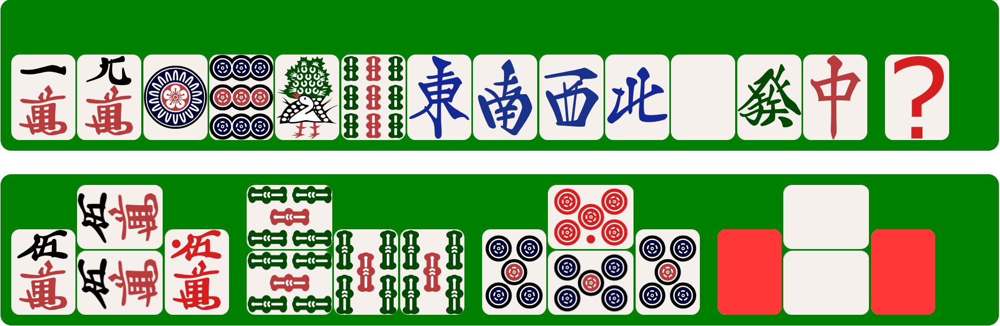

# Merjong

## About

Merjong is a JavaScript-based image generation tool that uses MPSZ algebraic notation to create images of mahjong tiles.

## Example

The following are some examples of Mahjong tile images rendered using Merjong.  

```html
<div class="merjong">19m19p19s1234567z-q</div>
<pre class="merjong">55"0m-5'5''55s-55'0''5p-X5"Xz</pre>
```



## Credits

Mahjong tile images are from [FluffyStuff/riichi-mahjong-tiles](https://github.com/FluffyStuff/riichi-mahjong-tiles), released to the public domain under [CC0 1.0](https://creativecommons.org/publicdomain/zero/1.0/).  
Huge thanks to FluffyStuff!
